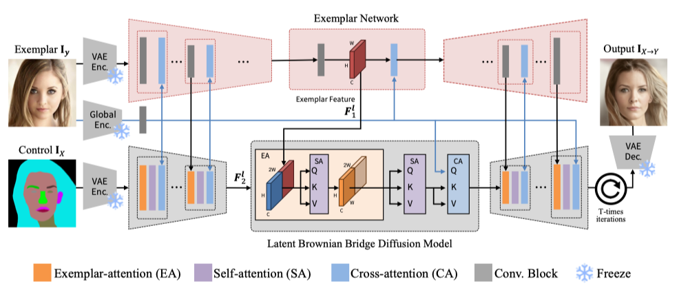

<h2 align="center">EBDM: Exemplar-guided Image Translation with Brownian-bridge Diffusion Models</h2>

    <a href="https://eungbean.com">Eungbean Lee</a>
    ·
    <a href="">Somi Jeong</a>
    ·
    <a href="">Kwanghoon Sohn</a>
  

  <h2 align="center">ECCV 2024</h2>

  <h3 align="center">
<a href="">Paper</a> | <a href="">arXiv</a> | <a href="">Project Page</a>
  

  

We introduce a Brownian Bridge Diffusion Model for exemplar-guided image translation (EGIT),  
 that translates from structure control to a photo-realistic image while exploiting style from exemplars.

<be>

## Updates
* We are diligently preparing the demo and code for public release, and resolving some license issues related to the code. While we cannot specify an exact release date right now, rest assured that our intention to offer access to both the demo and our source code is definite.
